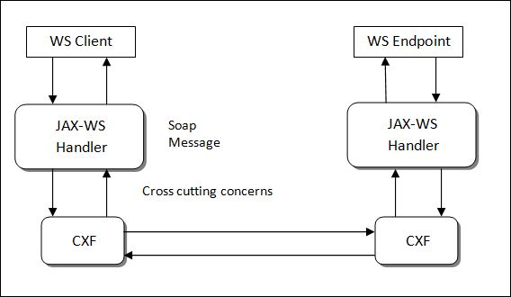

# JAX-WS Handlers

## Why and when to use the JAX-WS handlers

As we create service oriented applications and develop several web service endpoints and Web services consumers or clients, once in a while we need to address some cross-cutting concerns or nonfunctional requirements which have to be applied across Web services clients or across the web services Endpoints. That is, these requirements might not have anything to do with the business logic, but they need us to manipulate the SOAP message. It could be the SOAP headers, the SOAP body or it could be a completely different requirement which your application needs, but it is a nonfunctional requirement which should be applied across WS Endpoints. That is where the handlers available in the JAX-WS standard come into picture.

These handlers are classes that we develop by implementing certain interfaces in the JAX-WS API. And Web services stacks like Apache CXF will call into these handlers when the client request is sent from the client, when the request comes into the endpoint and the response goes back from the endpoint and also when the response comes back on to the client.

These handlers are very similar to servlet filters, except for these handlers can be applied both on the client side as well as the server side.

Whatever logic we write in the methods in the handlers will be called by web services stacks like CXF.

## Examples

Let's say you don't want to use the username token profile or whatever is available in the WS standard and you want to include your own SOAP headers, you can create handlers both on the provider side and the client side of your application and you can manipulate the SOAP headers inside the handlers. All the soap message information will be available to you when you create a handler.

The second possible usage can be Caching. So instead of our Web service doing a particular service everytime, we can create a handler that will Cache the responses and it can check the request to see if it's the same request which came in earlier and then it can send back the response from the cache instead of calling into the web services endpoint and executing then entire business logic and database operations again. 

The third usage which is a little weird again, but you never know what your applications need. To maintain a legacy application which has different versions of the same exact web service in the same exact application. So when the client sends in a request, we have to decide, we had to decide which particular web service will service that particular request based on the version that comes in the SOAP header. So our handler was dispatching it to the particular endpoint.

So all that can be done using JAX-WS handlers.

Sometimes we write the JAX-WS handlers and configure them only on the provider side and sometimes we do the client side and sometimes we do them on both sides. So depending on our application requirements, handlers can be written and configured for either the providers are the clients or both.

To summarize, JAX-WS handlers give you a custom way to manipulate the soap message or to address cross-cutting concerns like security caching which your application needs or the various endpoints in our application needs.

Some examples for JAX-WS handlers are to handle custom authentication, Caching, Versioning and so on. Anything that has to do with the SOAP message can be done using the Händler framework.

## Web Service Output Logs

	2020-08-21 12:16:30.136  INFO 15192 --- [nio-8080-exec-1] o.a.c.s.P.P.PostCodeFinder               : Inbound Message
	----------------------------
	ID: 1
	Address: http://localhost:8080/api/paf/v1/postcodefinder
	Encoding: UTF-8
	Http-Method: POST
	Content-Type: text/xml;charset=UTF-8
	Headers: {accept-encoding=[gzip,deflate], connection=[Keep-Alive], Content-Length=[557], content-type=[text/xml;charset=UTF-8], host=[localhost:8080], SOAPAction=[""], user-agent=[Apache-HttpClient/4.1.1 (java 1.5)]}
	Payload: <soapenv:Envelope xmlns:soapenv="http://schemas.xmlsoap.org/soap/envelope/" xmlns:ser="http://service.ws.soap.deepak.example.com/">
	   <soapenv:Header>
	   	<SiteName>United Kingdom</SiteName>
	   </soapenv:Header>
	   <soapenv:Body>
	      <ser:getPostalAddress>
	         <!--Optional:-->
	         <pafRequest>
	            <!--Optional:-->
	            <postcode>CR0 3RL</postcode>
	            <!--Optional:-->
	            <country>United Kingdom</country>
	         </pafRequest>
	      </ser:getPostalAddress>
	   </soapenv:Body>
	</soapenv:Envelope>
	--------------------------------------
	Inside getHeaders()
	2020-08-21 12:16:30.506 ERROR 15192 --- [nio-8080-exec-1] c.s.x.internal.messaging.saaj.soap.impl  : SAAJ0131: HeaderElements must be namespace qualified
	Inside handleMessage()
	Site Name : United Kingdom
	Inside getHeaders()
	Inside handleMessage()
	Response on the way
	Inside close()
	2020-08-21 12:16:30.734  INFO 15192 --- [nio-8080-exec-1] o.a.c.s.P.P.PostCodeFinder               : Outbound Message
	---------------------------
	ID: 1
	Response-Code: 200
	Encoding: UTF-8
	Content-Type: text/xml
	Headers: {}
	Payload: 
	<soap:Envelope xmlns:soap="http://schemas.xmlsoap.org/soap/envelope/">
		<soap:Body>
			<ns2:getPostalAddressResponse xmlns:ns2="http://service.ws.soap.deepak.example.com/">
				<response>
					<postalAddress>
						16-15 Fatory Lane Croydon, London
					</postalAddress>
					<result>true</result>
				</response>
			</ns2:getPostalAddressResponse>
		</soap:Body>
	</soap:Envelope>
	--------------------------------------

We can see the flow of the handle messages as below -

* On Request -
	 getHeaders() - Reads the headers from soap message
	 handleMessage() - Reads the Header messges from getHeaders() 

* On Response -
	getHeaders()
	handleMessage()
	close()

## Passing soap header values from SOAPHandler to Web-service implementation class

You can read the soap header from the SOAPMessageContext in a SOAPHandler class, then pass the values to your @WebService implementation via attributes in the MessageContext.

Please refer below code in SiteHandler.java class in this project which implements SOAPHandler<SOAPMessageContext> interface -

	// Set SiteName in "SOAPMessageContext" so that it can be access by WebService implementation.
	context.put("SITE_NAME", eachNode.getValue());
	context.setScope("SITE_NAME", Scope.APPLICATION);
	
	where context is an instance of 'SOAPMessageContext'
	
Now look at the below code of Web-service implementation which reads the header values from 'WebServiceContext'

	// Retrieve the SITE_NAME set by SOAP Handler in the SOAPMessageContext in SiteHandler.java class
	String siteName = (String) ctx.getMessageContext().get("SITE_NAME");

